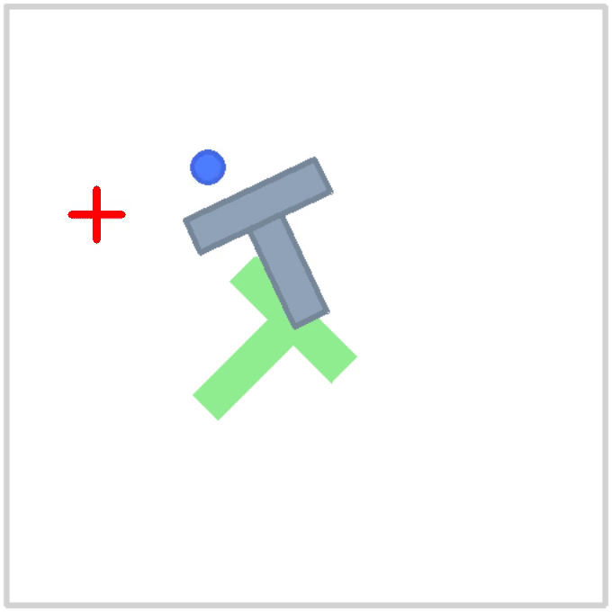
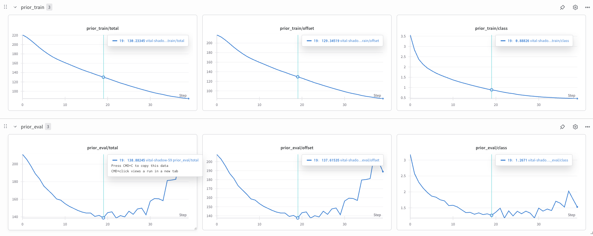
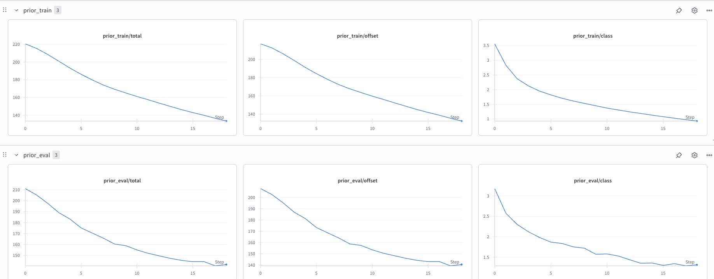
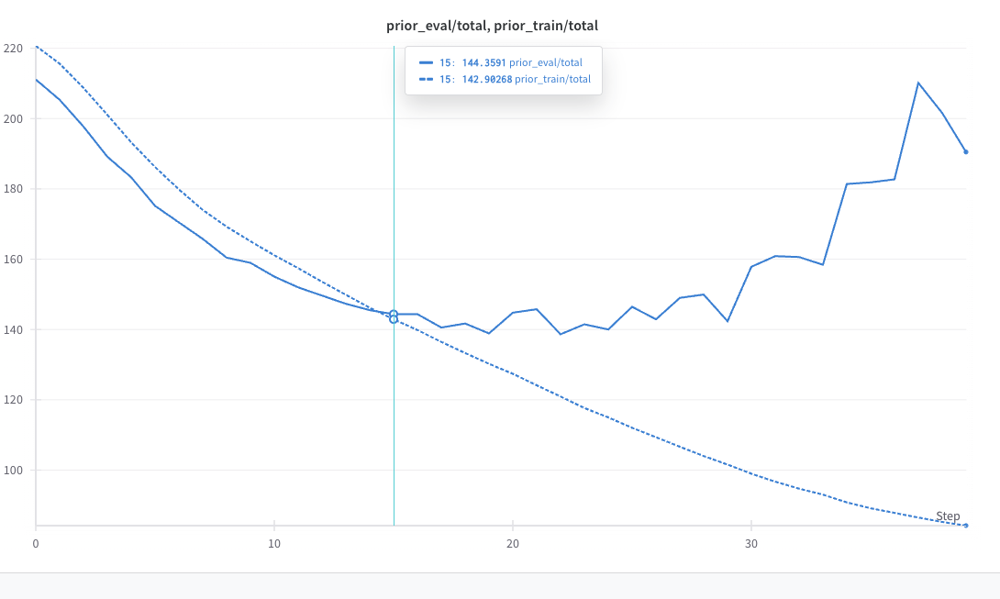

# Modified Behavior Transformer (BeT) for PushT in LeRobot

This repository contains a **modified Behavior Transformer (BeT)** integrated with the [LeRobot](https://github.com/huggingface/lerobot) framework, trained and evaluated on the **PushT** robotic manipulation task. The original BeT from this paper ["Behavior Transformers: Cloning k modes with one stone"](https://arxiv.org/abs/2206.11251) has been adapted and modified for the PushT data usecase and implemented.

The modification adapts BeT to the `lerobot/pusht` dataset and environment, using a transformer-based policy with **action discretization** and **offset correction** to handle multi-modal continuous actions.

---

## 📌 Installation & Environment Setup

Clone the repo:
```bash
git clone https://github.com/Satya1998-debug/behaviour_transformer_policy.git
cd behaviour_transformer_policy
```

LeRobot works with **Python 3.10+** and **PyTorch 2.2+**.  
It is recommended to use **conda**.

Creating and installing dependencies via conda: (recommended)
```bash
# Create and activate environment
conda env create --file=environment.yml
conda activate lerobot_bet
```

OR 

Creating and Installing dependencies via pip: (if you face conda issues, use this inside activated conda env)
```bash
conda create -y -n lerobot_bet python=3.10
conda activate lerobot_bet
pip install -r requirements.txt
```

Install ffmpeg
```bash
conda install ffmpeg -c conda-forge
```

Install LeRobot with PushT environment.
For simulations, 🤗 LeRobot comes with gymnasium environments that can be installed as extras:
- [pusht](https://github.com/huggingface/gym-pusht)
However, other environments can also be installed.

```bash
pip install -e ".[pusht]"
```

Install wandb for experiment tracking
```bash
pip install wandb
wandb login
```
---

## ⚙️ Model Architecture

The Modified BeT policy consists of:

> Action Discretizer
- Clusters continuous actions into k bins using k-means
- Stores bin centers for prediction

> Transformer Prior (MinGPT backbone)
- Input: sequence of past observations (window size h)
- Output: categorical distribution over action bins

> Offset Predictor
- Learns residual between bin center and ground truth action
- Improves precision over coarse discretization


```bash
.
├── README.md                                      # overview of the project working
├── enviroment.yml                                 # conda env details
├── requirements.txt                               # requirements for dependencies (if not used conda env file)
├── report.md                                      # full report 
├── train.py                                       # train script for the model
├── run_on_env.py                                  # evaluation script for the model
├── configs/                                       # configuration files for the env & model
│   ├── train_pusht.yaml                               # training parameters and configuration
│   ├── eval_pusht.yaml                                # testing, evaluation parameters
│   ├── env/                                           # hydra env config parameters for the project (model specific)
│   │   └── pusht.yaml
│   │── env_vars/                                      # hydra env config for dataset
│   │   └── env_vars.yaml
│   │── state_prior/                                   # hydra env model-specific config for prior model (mingpt)
│   │   └── mingpt_pusht_best.yaml
│   │── encoder/                                       # hydra env for observation encoder
│   │   └── identity.yaml
├── models/                                       # models base code
│   ├── mlp.py
│   ├── action_ae/
│   │   └── discretizers                               # discretizer 
│   │   └── generators                                 # generators
│   │── latent_generators/                             # latent generators for the latent tensors
│   │   └── latent_generator.py
│   │   └── mingpt.py                                  # adapted mingpt used (in paper)
│   │── libraries/
│   │   └── mingpt                                     # original mingpt (referenced in the paper)
│   │   └── loss_fn.py                                 # loss functions
├── utils/                                        # utilities like train-test splits
├── workspaces/                                   # workspaces for hydra env that has pushT from lerobot
│   ├── base.py
│   └── push_t.py/
├── dataloaders/                                  # PyTorch dataloaders
│   └── tracjectory_loader.py

```

The most important files are the config yaml files and the train-test scripts, which are neede to execute the training and evaluation phases of the process.

---

## 🚀 Training
Run training with:

```bash
python ./train.py --config-name=train_pusht
```
(or simply run the script in an IDE)

The training:
- Loads PushT dataset
- Splits into train/test episodes
- Fits k-means discretizer on all training actions
- Trains transformer prior with focal loss + offset correction
- Logs metrics to Weights & Biases

Checkpoints are saved in:

```lua
exp_local/{date}/{time}_pusht_train/
```
---

## 📈 Evaluation

After training, run evaluation:

```bash
python ./run_on_env.py --config-name=eval_pusht
```
(or simply run the script in an IDE)

The evaluation inlcudes:

- Loads the trained policy checkpoint(snapshots)
- Runs the PushT environment in rollout mode
- Computes success rate and task-specific metrics

The actions and latents can be saved in terms of check points.

The recorded videos of the Robot Manipulation are stored in (if recording flag is enabled):
(apart from videos, other metadata is also stored)
```lua
exp_local/{date}/{time}_pusht_eval/rl-video-episode...mp4
```

---

## 📊🎯 Results, Findings and Discussions

The implementation, design choices, results and possible improvements have been discussed.
All info can be found in the [full report](report.md).

---

## 📜 Acknowledgements
- [lerobot/pusht](https://github.com/huggingface/lerobot?tab=readme-ov-file):HuggingFace LeRobot for PushT dataset & environment
- [notmahi/BeT](https://github.com/notmahi/bet?tab=readme-ov-file): Multi-modal Behavior Transformer (BeT) architecture
- [karpathy/MinGPT](https://github.com/karpathy/minGPT): MinGPT implementation and hyperparameters.
- [facebookresearch/hydra](https://github.com/facebookresearch/hydra): Configuration managements.
- [psf/black](https://github.com/psf/black): Linting.

### Demo Video



Even though there are multiple cases that have been trained and evaluated, however few of them has been depocted here for viewing.



