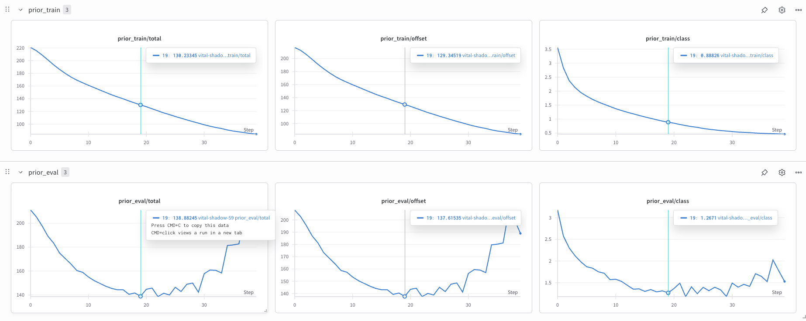

# Report: Modified Behavior Transformer for PushT Task using LeRobot framework

## 1. Description of Implementation
I implemented a **modified Behavior Transformer (BeT)** for robotic manipulation on the **PushT** environment from the LeRobot framework. The model uses a **Transformer-based prior (MinGPT)** combined with a **K-means action discretizer** and **residual offset prediction** to model multi-modal continuous actions.

Key elements:
- **Dataset**: `lerobot/pusht` from Hugging Face Hub.
- **Data loading**: Used LeRobot’s `LeRobotDataset` API with episode-level train/test split. (split at 0.95 fraction)
- **Policy architecture**:  
  - **Encoder**: Identity mapping for state observations.  
  - **Action Autoencoder (AE)**: Discretizes continuous actions into bins (K-means) and predicts residual offsets.  
  - **Transformer prior**: Learns to predict action bins conditioned on recent history. The predicted discrete bins are recondtructed to continous actions.
- **Loss functions**:
  - **Focal** loss for categorical bin classification.
  - **Masked MSE** loss for residual offsets.

### Implementation sequence:
- During **Configuration** before Training and Evaluation ...
  - Configuration yaml files inside *Configs*, need to be set (for model, hyper parameters, transformer, bins, epochs, dataset)
  - *train_pusht.yaml* needs to be set for training related parameters like epochs, window size etc.
  - *env_vars/env_vars.yaml* needs to be set for dataset path or url
  - *action_ae/discretizers/k_means_pusht_best.yaml* for bins and ofeset prediction
  - *env/pusht.yaml* for model save path, input (observations) and output (actions) dimensions, etc.
  - *state_prior/mingpt_pusht_best.yaml* for the transformer specific config like layers, heads, embeddings, etc.
  - *eval_pusht.yaml* needs to be set for evaluation related parameters like epochs, window size etc.
  - set all the wandb related things, by creating an account and configuring it to your local environment (not mandatory but Recommended!)

  - NOTE: LeRobot specific details have already been used in the code directly like delta_timestamps, FPS, etc. The device used her is MacOS MPS for the GPU related training, need to be adapted accordingly for Nvidia based GPUs with CUDA.

- During **Training** ...
  - need to run the *train.py* after all the needed configuration changes.
  - the model will stored in ./exp_local folder.
  - login to Wandb to see the progress of the training.

- During **Evaluation** ...
  - need to run the *run_on_env.py* after all the needed configuration changes.
  - the actions and latents will be stored in ./exp_local folder.
  - the recorded videos are stored every 10th episode inside the same folder.
  - final Rewards are printed at the end of evaluation

NOTE: the original git repository for the BeT has been cloned and adapted based on the requirements for PushT related framework and datsbase.

---

## 2. Design Choices and Challenges Faced
**Design Choices**:
- used various *batch_sizes* for training
- Used various *number of clusters/bins* with the existing BeT model that employs k-means for action discreetization.
- Used multiple *window size* observation-action pairs.
- Used *episode-level splitting* for train/validation sets, based on the margin/boundary frame, to make sure that the frames are loaded from the same episode by the PyTorch dataloader from lerobot.
- Based on comparing the training and validation errors with epochs, I adapted the number of epochs for the final evaluation.

**Challenges**:
- *Environment Compatibility* as the PushT environment uses `gymnasium` instead of `gym`, requiring changes to imports.
- *Data Splitting* for maintaining temporal integrity of episodes during splitting was critical — random shuffling across frames breaks sequential dependencies.
- *Hydra* environments need to be taken care while training, as the existing code was fully dependent on this.
- *Recording video* was a challenged which was later figured out.
- *Pybullet* issue with MacOS, can happen based on macOS version (didnot fully understand the issue)
- TorchCodec issue in macOS, resolved with dataset.video_backend = "pyav"

---

## 3. Results

**Qualitative Analysis**:
- The model **successfully commits to a consistent pushing strategy** without switching mid-episode.
- Handles **both left and right push modes** in multi-modal datasets.
- Occasional failures happen when **offset corrections are inaccurate** near the goal position.

**Training Curves**:  

Even though there are multiple cases that have been trained and evaluated, however few of them has been depocted here for viewing.

### Demo Video for Episode 20 (205628_pusht_eval-case1)
<video src="plots/rl-video-episode-20.mp4" controls width="640"></video>
https://github.com/Satya1998-debug/behaviour_transformer_policy/blob/master/plots/rl-video-episode-20.mp4

All the files and configs have been stored in exp_local/ for reference.

---

## 4. Improvements and Scaling

**Improvements**:
- the *Redundancy* can be removed when discritizing the actions, because each batch with a given window_size has repeated values of observation and action sequences. This unnecessarily increases the dimensionality for k-means clustering. This will balance the clustering and improve accuracy.
- the *delta_timestamps* can be modified to change the order of samples (say, we can reverse the list) that are fetched from the lerobot, then we can train again to see the difference.
- training the model with *One Episode per epoch* (batches of frames from a single episode for that epoch), might improve the relevance.

**Scaling**:
- Extend to *image-based PushT* by adding a CNN encoder (e.g., ResNet18) for pixel observations (which was also there in priginal BeT but have been removed for now).
- Use *larger Transformer architectures* for longer temporal horizons.
- Apply to *more complex multi-object manipulation tasks* (ALOHA, Franka Kitchen) to test scalability.
- Experiment with *online fine-tuning* to adapt to unseen dynamics.
